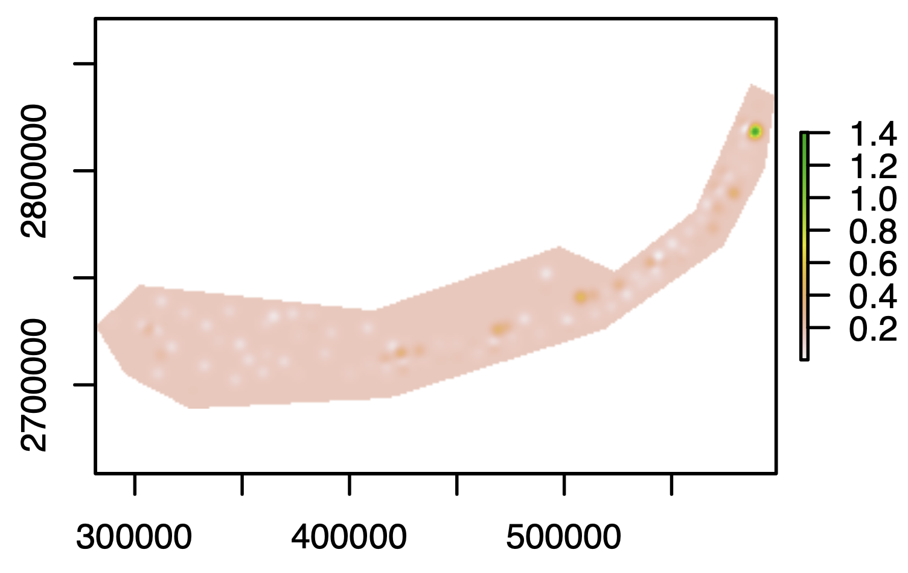

# smoothKrige
## Kriging with regularization

Function `smooth.krig` was developed for kriging SERC water quality data for Florida Keys, http://serc.fiu.edu/wqmnetwork/. which are water quality measures at a bunch of specific locations: \

\
We want extrapolate them into a full raster grid covering the whole FL Keys. \
\
A typical approach to this is Krige interpolation, but it can be finicky.
Sometimes it does't smooth things over and basically generates a map of original points on the uniform mean background: \

\
And conversely, sometimes it smoothes things way too much:\

\
The reason for both these problems is that the Krige function cannot fit a good variogram (dependence of measure difference on physical distance) to the data, either because the data is too noisy or otherwise weirdly shaped. \
\
The function `smooth.krig` here solves this problems in two ways. \
\
First, it gives the user an option to smoothen ("regularize") the original data, using a Gaussian kernel, prior to kriging. Here we use 5km kernel (our grid resolution is 1km)\
\
Second, we can force the kriging process to use a user-supplied variogram, which is fitted to some reliable data from the same environment. Here we take satellite-derived measurements of temperature, turbidity, chlorophyll, and depth, compute the first principal component of their variation, and fit a Matern variogram model to its variation across the seascape: \

\
The result certainly looks much better than the original. Here is the formerly pointy one:\
\
\
and this is the formerly over-smoothed one:\
\
\
Moreover, with the user-supplied variogram, guarantees that the krigin process will be exactly the same for different datasets (for example, data for different time periods).

### Files contained here

- `smooth.krig.R` : the main R function for regularized kriging
- `smooth.krig.test.R` : R script to demonstrate how it works, with some accessory code (to form a spatial polygon by clicking on a map, and to fit a fixed variogram model).
- several `.RData` bundles containing the data used by `smooth.krig.test.R`.
- `variogram_model_satPC1.RData` : variogram model for Florida Keys environment, based on satellite data. I would assume it would be applicable to any Caribbean reef environment. The code to generate such a model is "appendix 2" in `smooth.krig.test.R`.
  
